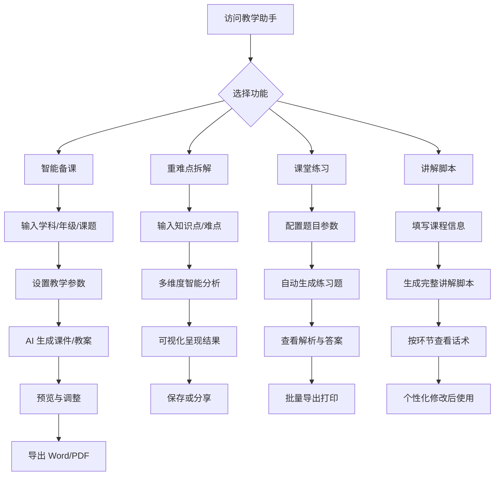

# 乡村教师智能教学助手 - 产品需求文档 (PRD)

## 1. 产品概述

**为乡村教师打造的 AI 智能教学辅助平台**，解决教育资源不均衡问题，帮助教师高效备课、智能生成教学资源，让每一位乡村教师都能获得专业的教学支持。

- **核心目标**：通过 AI 技术降低教师备课负担，提供可复用的教学资源和方法，成为教师随时响应的"得力搭档"
- **目标用户**：乡村中小学教师（资源有限、教研支持不足的一线教育工作者）
- **产品价值**：提升教学质量、减轻工作负担、促进教育公平

---

## 2. 核心功能

### 2.1 用户角色

| 角色 | 使用方式 | 核心权限 |
|------|----------|----------|
| 乡村教师 | 免费使用（无需注册） | 生成课件/教案、重难点拆解、课堂练习创建、讲解脚本生成 |
| 管理员 | 后台管理（预留） | 内容审核、数据统计 |

### 2.2 功能模块

1. **首页仪表盘**：快速入口、最近使用记录、每日推荐资源
2. **AI 智能备课中心**：课件生成、教案编写、教学计划制定
3. **重难点拆解工具**：知识点分析、分层讲解、可视化呈现
4. **课堂练习工坊**：自动出题、难度分级、答案解析
5. **讲解脚本生成器**：课堂话术模板、互动环节设计、时间分配建议
6. **资源库**：优秀案例库、模板库、学科分类浏览

### 2.3 页面详情

| 页面名称 | 模块名称 | 功能描述 |
|-----------|-------------|---------------------|
| 首页 | Hero 区域 | 温暖的教育主题视觉、核心价值主张展示、快速操作入口 |
| 首页 | 功能卡片网格 | 四大核心功能模块的快捷入口（带图标和简短说明） |
| 首页 | 最近使用记录 | 展示用户最近生成的教学内容，支持一键重新编辑 |
| 首页 | 每日推荐 | 根据学科和时间推送精选教学资源和技巧 |
| AI 备课中心 | 输入面板 | 学科选择、年级选择、课题名称输入、教学目标设定 |
| AI 备课中心 | 参数配置 | 课时长度、学生水平、教学风格偏好（生动/严谨/互动） |
| AI 备课中心 | 结果展示区 | 生成的完整课件/教案内容，支持导出（Word/PDF） |
| 重难点拆解 | 知识点输入 | 输入具体的教学难点或知识点名称 |
| 重难点拆解 | 分析结果 | 多维度拆解（概念解释→实例演示→易错点→进阶应用） |
| 重难点拆解 | 可视化图表 | 思维导图、流程图、对比表格等可视化呈现 |
| 课堂练习工坊 | 题目配置 | 选择题型（选择题/填空题/简答题）、数量、难度等级 |
| 课堂练习工坊 | 题目生成 | 自动生成配套练习题及详细解析 |
| 课堂练习工坊 | 练习管理 | 题目预览、编辑调整、批量导出 |
| 讲解脚本生成器 | 课程信息 | 输入课程主题、时长、关键知识点 |
| 讲解脚本生成器 | 脚本输出 | 完整的课堂讲解话术，包含导入→展开→互动→总结各环节 |
| 资源库 | 分类导航 | 按学科、年级、类型筛选浏览 |
| 资源库 | 详情页面 | 资源预览、使用场景说明、一键套用模板 |

---

## 3. 核心流程

### 3.1 用户主要使用流程

```
教师打开平台 → 选择所需功能 → 输入教学需求 → AI 生成内容 → 预览调整 → 导出使用
```

### 3.2 流程图



---

## 4. 用户界面设计

### 4.1 设计风格

**整体定位**：温暖、专业、亲切、高效

- **主色调**：
  - 主色：`#2563EB`（智慧蓝 - 代表知识与信任）
  - 辅助色：`#F59E0B`（活力橙 - 代表热情与创造力）
  - 强调色：`#10B981`（成长绿 - 代表进步与希望）
  - 中性色：暖灰色系 `#F9FAFB` / `#F3F4F6` / `#6B7280`
  
- **按钮样式**：
  - 主要按钮：圆角（12px）、渐变色背景、轻微阴影、hover 时微上浮效果
  - 次要按钮：描边样式、透明背景、hover 填充
  
- **字体选择**：
  - 标题字体：`Noto Serif SC`（思源宋体）- 体现教育的文化底蕴
  - 正文字体：`Noto Sans SC`（思源黑体）- 清晰易读
  - 英文/数字：`DM Sans` - 现代感
  
- **布局风格**：
  - 卡片式布局 + 圆角设计
  - 左侧固定导航栏（桌面端）/ 底部标签栏（移动端）
  - 内容区域采用流式布局，留白充足
  
- **图标/插画风格**：
  - 采用线性图标（Outlined Icons）+ 柔和配色
  - Hero 区域使用教育主题插画（黑板、书本、教师剪影等元素）

### 4.2 页面设计概览

| 页面名称 | 模块名称 | UI 元素 |
|-----------|-------------|-------------|
| 首页 | Hero 区域 | 全宽渐变背景（蓝橙渐变）、大标题"让每一堂课都精彩"、副标题描述、CTA 按钮"开始备课"、装饰性教育图标 |
| 首页 | 功能卡片 | 4 列网格布局、每个卡片包含：彩色图标（48px）、功能标题、简短描述、悬停时卡片上浮 + 阴影增强 |
| 首页 | 最近使用 | 时间线式列表、显示资源类型图标、标题、生成时间、快速操作按钮 |
| AI 备课中心 | 输入表单 | 分步向导界面（Step 1: 基本信息 → Step 2: 教学目标 → Step 3: 参数配置）、每步骤带进度指示器 |
| AI 备课中心 | 结果展示 | 富文本编辑器样式、左侧目录树、右侧内容区、顶部工具栏（导出/打印/复制） |
| 重难点拆解 | 分析面板 | 三栏布局（左：输入、中：思维导图、右：详细文字说明）、支持拖拽调整 |
| 课堂练习工坊 | 题目列表 | 卡片式题目展示、每张卡片显示题型标签、难度标识（简单/中等/困难）、展开查看详情 |
| 讲解脚本生成器 | 脚本视图 | 时间轴形式展示各环节（导入 5min → 新授 20min → 练习 10min → 总结 5min）、每个节点可点击展开详细话术 |
| 资源库 | 浏览网格 | Masonry 瀑布流布局、资源卡片显示封面色块、标题、学科标签、使用次数 |

### 4.3 响应式设计

- **桌面优先策略**（Desktop-first）
  - 桌面端（≥1200px）：三栏布局（导航 + 主内容 + 侧边栏）
  - 平板端（768px-1199px）：两栏布局（导航折叠为主内容区）
  - 移动端（<768px）：单栏布局 + 底部标签导航
- **触摸优化**：移动端按钮最小触控区域 44x44px，表单元素间距增大
- **断点适配**：图片、字体大小、间距在各断点下平滑过渡

### 4.4 动效与交互设计

- **页面加载**：内容区块依次淡入（staggered reveal），延迟 100ms 递增
- **卡片交互**：hover 时上浮 4px + 阴影扩散（0 8px 25px rgba(0,0,0,0.1)）
- **按钮反馈**：点击时缩放至 95%，释放时恢复
- **转场动画**：页面切换采用淡入淡出 + 轻微位移（300ms ease-out）
- **加载状态**：骨架屏（Skeleton Screen）或脉冲动画（Pulse Animation）
- **成功提示**：右上角 Toast 通知，绿色勾选图标 + 滑入动画

---

## 5. 数据需求（模拟数据）

### 5.1 学科列表

```json
[
  { "id": "chinese", "name": "语文", "icon": "📚", "color": "#EF4444" },
  { "id": "math", "name": "数学", "icon": "🔢", "color": "#3B82F6" },
  { "id": "english", "name": "英语", "icon": "🔤", "color": "#10B981" },
  { "id": "physics", "name": "物理", "icon": "⚡", "color": "#F59E0B" },
  { "id": "chemistry", "name": "化学", "icon": "🧪", "color": "#8B5CF6" },
  { "id": "biology", "name": "生物", "icon": "🌿", "color": "#06B6D4" },
  { "id": "history", "name": "历史", "icon": "🏛️", "color": "#D97706" },
  { "id": "geography", "name": "地理", "icon": "🌍", "color": "#059669" }
]
```

### 5.2 年级列表

```json
[
  { "id": "grade1", "name": "一年级" }, { "id": "grade2", "name": "二年级" },
  { "id": "grade3", "name": "三年级" }, { "id": "grade4", "name": "四年级" },
  { "id": "grade5", "name": "五年级" }, { "id": "grade6", "name": "六年级" },
  { "id": "junior1", "name": "初一" }, { "id": "junior2", "name": "初二" },
  { "id": "junior3", "name": "初三" }, { "id": "senior1", "name": "高一" },
  { "id": "senior2", "name": "高二" }, { "id": "senior3", "name": "高三" }
]
```

### 5.3 示例输出数据结构

**课件/教案生成结果示例**：

```json
{
  "id": "lesson_001",
  "type": "courseware",
  "subject": "数学",
  "grade": "初二",
  "topic": "一元二次方程",
  "createdAt": "2024-01-15T08:30:00Z",
  "content": {
    "title": "一元二次方程的概念与解法",
    "objectives": ["理解一元二次方程的定义", "掌握因式分解法求解"],
    "duration": "45分钟",
    "sections": [
      {
        "title": "课程导入（5分钟）",
        "content": "回顾一元一次方程，引出一元二次方程...",
        "activities": ["提问互动", "举例说明"]
      },
      {
        "title": "新知讲授（20分钟）",
        "content": "定义讲解、公式推导、例题演示...",
        "keyPoints": ["一般形式 ax²+bx+c=0", "判别式 Δ=b²-4ac"]
      },
      {
        "title": "课堂练习（15分钟）",
        "content": "基础练习3道、提升练习2道...",
        "exercises": [...]
      },
      {
        "title": "总结归纳（5分钟）",
        "content": "知识梳理、方法总结、作业布置..."
      }
    ]
  }
}
```

---

## 6. 非功能性需求

### 6.1 性能要求

- 首屏加载时间 < 2 秒（3G 网络）
- AI 生成响应时间 < 5 秒（模拟）
- 页面切换动画流畅度 ≥ 60fps

### 6.2 可用性要求

- 操作流程不超过 3 步即可完成核心任务
- 所有文案清晰易懂，避免专业术语堆砌
- 提供操作引导和帮助提示

### 6.3 兼容性要求

- 支持现代浏览器（Chrome、Firefox、Edge、Safari 最新两个版本）
- 支持移动端浏览器（iOS Safari、Android Chrome）

---

## 7. 成功指标

- **用户体验**：教师能够在 3 分钟内完成一份基础课件的生成
- **功能完整性**：覆盖语数英理化生史地 8 大学科
- **实用性**：生成的内容可直接用于课堂教学或稍作调整后使用
