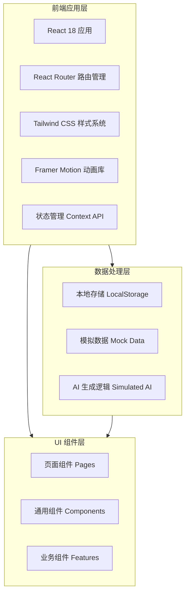
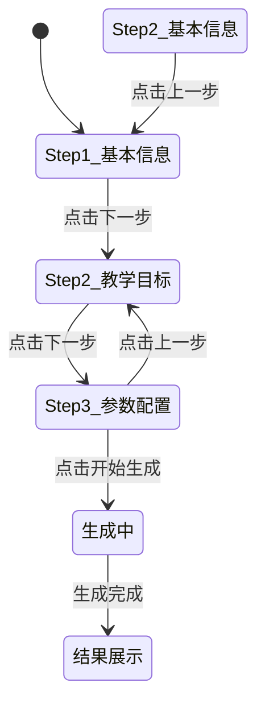

# 乡村教师智能教学助手 - 技术架构文档

## 1. 架构设计

### 1.1 系统架构概览



### 1.2 技术选型理由

| 技术组件 | 选型方案 | 选择原因 |
|-----------|----------|----------|
| 框架 | React 18 | 组件化开发、生态丰富、适合复杂交互应用 |
| 构建工具 | Vite 5 | 快速冷启动、HMR 体验好、构建效率高 |
| 样式方案 | Tailwind CSS 3 | 原子化 CSS、快速迭代、响应式友好 |
| 动画库 | Framer Motion | 声明式动画、性能优化、React 原生集成 |
| 路由 | React Router v6 | 声明式路由、嵌套路由支持良好 |
| 图标库 | Lucide React | 轻量、一致性好、Tree-shaking 友好 |
| 字体 | Google Fonts (Noto Sans/Serif SC) | 中文支持完善、免费商用 |

---

## 2. 项目结构设计

```
teaching-assistant/
├── public/
│   └── favicon.ico
├── src/
│   ├── assets/                    # 静态资源
│   │   ├── images/               # 图片文件
│   │   └── icons/                # 自定义图标
│   │
│   ├── components/                # 通用 UI 组件
│   │   ├── ui/                   # 基础 UI 组件
│   │   │   ├── Button.jsx
│   │   │   ├── Card.jsx
│   │   │   ├── Input.jsx
│   │   │   ├── Select.jsx
│   │   │   ├── Modal.jsx
│   │   │   └── Toast.jsx
│   │   ├── layout/               # 布局组件
│   │   │   ├── Header.jsx
│   │   │   ├── Sidebar.jsx
│   │   │   ├── Footer.jsx
│   │   │   └── MainLayout.jsx
│   │   └── common/               # 公共业务组件
│   │       ├── SubjectIcon.jsx
│   │       ├── GradeBadge.jsx
│   │       └── LoadingSpinner.jsx
│   │
│   ├── pages/                     # 页面组件
│   │   ├── Home/                 # 首页
│   │   │   ├── index.jsx
│   │   │   ├── HeroSection.jsx
│   │   │   ├── FeatureCards.jsx
│   │   │   ├── RecentActivities.jsx
│   │   │   └── DailyRecommend.jsx
│   │   ├── LessonGenerator/     # AI 备课中心
│   │   │   ├── index.jsx
│   │   │   ├── StepBasicInfo.jsx
│   │   │   ├── StepObjectives.jsx
   │   │   │   ├── StepConfig.jsx
│   │   │   └── ResultDisplay.jsx
│   │   ├── DifficultyAnalyzer/  # 重难点拆解
│   │   │   ├── index.jsx
│   │   │   ├── InputPanel.jsx
│   │   │   ├── MindMap.jsx
│   │   │   └── DetailPanel.jsx
│   │   ├── ExerciseWorkshop/    # 课堂练习工坊
│   │   │   ├── index.jsx
│   │   │   ├── ConfigPanel.jsx
│   │   │   ├── QuestionList.jsx
│   │   │   └── QuestionCard.jsx
│   │   ├── ScriptGenerator/     # 讲解脚本生成器
│   │   │   ├── index.jsx
│   │   │   ├── TimelineView.jsx
│   │   │   └── ScriptDetail.jsx
│   │   └── ResourceLibrary/      # 资源库
│   │       ├── index.jsx
│   │       ├── FilterBar.jsx
│   │       └── ResourceGrid.jsx
│   │
│   ├── data/                      # 数据层
│   │   ├── mock/                 # 模拟数据
│   │   │   ├── subjects.js
│   │   │   ├── grades.js
│   │   │   ├── templates.js
│   │   │   └── sampleOutputs.js
│   │   └── services/            # 业务逻辑服务
│   │       ├── aiService.js     # AI 模拟服务
│   │       ├── storageService.js # 本地存储服务
│   │       └── exportService.js  # 导出服务
│   │
│   ├── hooks/                     # 自定义 Hooks
│   │   ├── useLocalStorage.js
│   │   ├── useDebounce.js
│   │   └── useAnimation.js
│   │
│   ├── context/                   # React Context
│   │   └── AppContext.jsx         # 全局状态管理
│   │
│   ├── utils/                     # 工具函数
│   │   ├── formatters.js
│   │   ├── validators.js
│   │   └── constants.js
│   │
│   ├── styles/                    # 全局样式
│   │   ├── globals.css           # Tailwind 入口 + 自定义样式
│   │   └── animations.css        # 动画定义
│   │
│   ├── App.jsx                    # 根组件
│   ├── main.jsx                   # 入口文件
│   └── router.jsx                 # 路由配置
│
├── index.html
├── tailwind.config.js
├── postcss.config.js
├── vite.config.js
├── package.json
└── README.md
```

---

## 3. 路由定义

| 路由路径 | 页面名称 | 组件路径 | 说明 |
|-----------|----------|----------|------|
| `/` | 首页 | `pages/Home/index.jsx` | 仪表盘、功能入口、推荐内容 |
| `/lesson-generator` | AI 备课中心 | `pages/LessonGenerator/index.jsx` | 课件/教案生成 |
| `/difficulty-analyzer` | 重难点拆解 | `pages/DifficultyAnalyzer/index.jsx` | 知识点多维度分析 |
| `/exercise-workshop` | 课堂练习工坊 | `pages/ExerciseWorkshop/index.jsx` | 自动出题与练习管理 |
| `/script-generator` | 讲解脚本生成器 | `pages/ScriptGenerator/index.jsx` | 课堂话术生成 |
| `/resource-library` | 资源库 | `pages/ResourceLibrary/index.jsx` | 模板与案例浏览 |

---

## 4. 核心技术实现方案

### 4.1 AI 模拟生成机制

由于是前端演示项目，采用**规则引擎 + 模板填充**的方式模拟 AI 生成：

```javascript
// 示例：aiService.js 核心逻辑
class AIService {
  // 根据学科、年级、课题生成课件
  async generateLessonPlan(params) {
    const { subject, grade, topic, objectives, duration } = params;
    
    // 1. 从模板库匹配最接近的模板
    const template = this.matchTemplate(subject, topic);
    
    // 2. 填充动态内容
    const content = this.fillTemplate(template, {
      topic,
      grade,
      objectives,
      duration,
      examples: this.generateExamples(subject, topic),
      exercises: this.generateExercises(subject, grade)
    });
    
    // 3. 模拟网络延迟（提升真实感）
    await this.simulateDelay(1500, 3000);
    
    return {
      id: this.generateId(),
      type: 'lesson',
      createdAt: new Date().toISOString(),
      content
    };
  }

  // 重难点拆解
  async analyzeDifficulty(topic, subject) {
    const analysisTemplate = {
      concept: `【${topic}】的核心概念`,
      explanation: this.generateExplanation(topic),
      commonMistakes: this.generateCommonMistakes(topic),
      examples: this.generateDetailedExamples(topic),
      advancedApplications: this.generateAdvancedContent(topic),
      mindMapData: this.generateMindMapData(topic)
    };
    
    await this.simulateDelay(1000, 2000);
    return analysisTemplate;
  }

  // 生成练习题
  async generateExercises(config) {
    const { subject, grade, type, count, difficulty } = config;
    
    const questions = Array.from({ length: count }, (_, i) => ({
      id: `q_${i + 1}`,
      type,
      difficulty,
      question: this.generateQuestion(subject, grade, type, difficulty),
      options: type === 'choice' ? this.generateOptions() : null,
      answer: this.generateAnswer(),
      explanation: this.generateExplanation()
    }));
    
    await this.simulateDelay(800, 1500);
    return questions;
  }
}
```

### 4.2 本地持久化方案

使用 `localStorage` 存储用户的生成历史和偏好设置：

```javascript
// storageService.js
const STORAGE_KEYS = {
  HISTORY: 'teaching_assistant_history',
  PREFERENCES: 'teaching_assistant_preferences',
  FAVORITES: 'teaching_assistant_favorites'
};

export const storageService = {
  saveToHistory(item) {
    const history = this.getHistory();
    history.unshift(item);
    // 只保留最近 50 条记录
    if (history.length > 50) history.pop();
    localStorage.setItem(STORAGE_KEYS.HISTORY, JSON.stringify(history));
  },

  getHistory() {
    const data = localStorage.getItem(STORAGE_KEYS.HISTORY);
    return data ? JSON.parse(data) : [];
  },

  savePreferences(prefs) {
    localStorage.setItem(STORAGE_KEYS.PREFERENCES, JSON.stringify(prefs));
  },

  getPreferences() {
    const data = localStorage.getItem(STORAGE_KEYS.PREFERENCES);
    return data ? JSON.parse(data) : { defaultSubject: '', defaultGrade: '' };
  }
};
```

### 4.3 导出功能实现

支持将生成的内容导出为 Word 或 PDF 格式（前端纯客户端实现）：

```javascript
// exportService.js（简化版思路）
export const exportService = {
  async exportToWord(content, filename) {
    // 方案1：生成 HTML 转 Blob 下载（简单但格式有限制）
    const htmlContent = this.generateHTML(content);
    const blob = new Blob([htmlContent], { type: 'application/msword' });
    this.downloadBlob(blob, `${filename}.doc`);
    
    // 方案2（推荐）：使用 docx 库生成真正的 .docx 文件
    // import { Document, Packer, Paragraph } from 'docx';
    // const doc = new Document({ sections: [...] });
    // const buffer = await Packer.toBuffer(doc);
    // this.downloadBlob(new Blob([buffer]), filename);
  },

  async exportToPDF(content, filename) {
    // 使用 html2canvas + jsPDF 实现
    // 或调用浏览器原生打印功能（window.print）
  },

  downloadBlob(blob, filename) {
    const url = URL.createObjectURL(blob);
    const a = document.createElement('a');
    a.href = url;
    a.download = filename;
    a.click();
    URL.revokeObjectURL(url);
  }
};
```

---

## 5. 状态管理方案

使用 React Context API 进行轻量级全局状态管理：

```jsx
// context/AppContext.jsx
import { createContext, useContext, useReducer, useEffect } from 'react';

const AppContext = createContext();

const initialState = {
  currentUser: null,           // 当前用户信息（预留）
  recentHistory: [],           // 最近使用记录
  favorites: [],               // 收藏的资源
  preferences: {               // 用户偏好
    defaultSubject: '',
    defaultGrade: '',
    theme: 'light'
  },
  isLoading: false,            // 全局加载状态
  notifications: []            // 通知消息队列
};

function appReducer(state, action) {
  switch (action.type) {
    case 'ADD_TO_HISTORY':
      return { ...state, recentHistory: [action.payload, ...state.recentHistory].slice(0, 50) };
    case 'SET_LOADING':
      return { ...state, isLoading: action.payload };
    case 'UPDATE_PREFERENCES':
      return { ...state, preferences: { ...state.preferences, ...action.payload } };
    case 'ADD_NOTIFICATION':
      return { ...state, notifications: [...state.notifications, action.payload] };
    case 'REMOVE_NOTIFICATION':
      return { ...state, notifications: state.notifications.filter(n => n.id !== action.payload) };
    default:
      return state;
  }
}

export function AppProvider({ children }) {
  const [state, dispatch] = useReducer(appReducer, initialState);

  useEffect(() => {
    // 初始化时从 localStorage 加载数据
    const savedPrefs = localStorage.getItem('preferences');
    const savedHistory = localStorage.getItem('history');
    if (savedPrefs) dispatch({ type: 'UPDATE_PREFERENCES', payload: JSON.parse(savedPrefs) });
    if (savedHistory) dispatch({ type: 'LOAD_HISTORY', payload: JSON.parse(savedHistory) });
  }, []);

  return (
    <AppContext.Provider value={{ state, dispatch }}>
      {children}
    </AppContext.Provider>
  );
}

export const useAppContext = () => useContext(AppContext);
```

---

## 6. 关键页面组件设计

### 6.1 首页（Home Page）

**组件结构**：
```
HomePage
├── Header（导航栏）
├── HeroSection（主视觉区域）
│   ├── 渐变背景 + 装饰性图形
│   ├── 主标题："让每一堂课都精彩"
│   ├── 副标题："AI 赋能乡村教育，让备课更轻松"
│   └── CTA 按钮组
├── FeatureCards（功能卡片网格）
│   ├── LessonCard（智能备课）
│   ├── AnalysisCard（重难点拆解）
│   ├── ExerciseCard（课堂练习）
│   └── ScriptCard（讲解脚本）
├── RecentActivities（最近使用）
│   └── ActivityItem[]（活动项列表）
├── DailyRecommend（每日推荐）
│   └── RecommendCard[]
└── Footer
```

**交互细节**：
- Hero 区域背景使用动态渐变或粒子效果（轻量级）
- 功能卡片 hover 时上浮 + 发光效果
- 最近使用记录支持滑动删除、一键重新生成

### 6.2 AI 备课中心（Lesson Generator）

**分步表单流程**：



**核心交互**：
- 步骤切换带有滑入/滑出动画
- 实时字数统计和输入验证
- 生成过程中显示骨架屏 + 进度提示
- 结果支持富文本预览、实时编辑、多格式导出

### 6.3 重难点拆解（Difficulty Analyzer）

**三栏布局设计**：
```
┌─────────────────────────────────────────────────────┐
│  [输入面板 25%] │ [思维导图 40%] │ [详情面板 35%]   │
│                 │              │                    │
│  知识点输入框   │   可视化图谱  │  概念解释          │
│  学科选择       │   （交互式）  │  实例演示          │
│  相关推荐       │              │  易错点提醒        │
│  历史记录       │              │  进阶应用          │
└─────────────────────────────────────────────────────┘
```

**思维导图实现**：
- 使用 SVG 或 Canvas 绘制
- 支持节点点击展开/收起
- 节点间连线使用贝塞尔曲线
- 配色根据学科自动调整

### 6.4 课堂练习工坊（Exercise Workshop）

**题目卡片组件**：
```jsx
<QuestionCard>
  <CardHeader>
    <TypeBadge>选择题</TypeBadge>
    <DifficultyBadge level="medium">中等</DifficultyBadge>
    <QuestionNumber>第 3 题</QuestionNumber>
  </CardHeader>
  <CardBody>
    <QuestionText>若方程 x² - 5x + 6 = 0 的两根为 x₁ 和 x₂，则 x₁ + x₂ = ?</QuestionText>
    <OptionsList>
      <Option label="A">3</Option>
      <Option label="B">5</Option>
      <Option label="C">6</Option>
      <Option label="D">-5</Option>
    </OptionsList>
  </CardBody>
  <CardFooter>
    <ToggleButton>显示答案</Toggle>
    <ActionButton>编辑</ActionButton>
  </CardFooter>
</QuestionCard>
```

### 6.5 讲解脚本生成器（Script Generator）

**时间轴视图**：

```
┌─ 课堂讲解脚本 ─────────────────────────────────────┐
│                                                      │
│  🕐 总时长：40 分钟                                  │
│                                                      │
│  ●━━━━━━━━━━━━━━━━━━━━━━━━━━━━━━━━━━━━━━━━━━━━━●    │
│  ↑                                           ↑      │
│ [导入 5min]                              [总结 5min] │
│                                                      │
│  ┌─ 环节 1：课程导入（5分钟）─────────────────┐      │
│  │  ▶ 【开场白】同学们，今天我们来学习...      │      │
│  │  ▶ 【互动提问】大家还记得上节课讲的...吗？  │      │
│  │  ▶ 【引入新知】那么什么是...呢？让我们...   │      │
│  └──────────────────────────────────────────────┘      │
│                                                      │
│  ┌─ 环节 2：新知讲授（20分钟）────────────────┐      │
│  │  ▶ 【概念讲解】首先我们来看定义...          │      │
│  │  │  （点击展开详细话术）                    │      │
│  │  ▶ 【例题演示】现在看这道例题...            │      │
│  │  ▶ 【要点强调】这里要特别注意...            │      │
│  └──────────────────────────────────────────────┘      │
│                                                      │
│  ... 更多环节 ...                                     │
└──────────────────────────────────────────────────────┘
```

---

## 7. 性能优化策略

### 7.1 加载性能

- **代码分割**：使用 `React.lazy()` + `Suspense` 实现路由级懒加载
- **资源优化**：图片使用 WebP 格式、字体子集化（只加载中文字符）
- **缓存策略**：合理利用浏览器缓存、Service Worker（可选）
- **首屏优化**：关键内联 CSS、延迟加载非首屏组件

### 7.2 运行时性能

- **虚拟滚动**：长列表使用 react-window 或自定义虚拟列表
- **防抖节流**：搜索输入、窗口 resize 等事件做防抖处理
- **Memo 优化**：合理使用 React.memo、useMemo、useCallback
- **动画性能**：使用 transform/opacity 触发 GPU 加速，避免 layout thrashing

### 7.3 包体积控制

- Tree-shaking：确保依赖库支持按需引入
- 代码分析：定期使用 bundle-analyzer 分析包体积
- 按需加载：重型库（如 PDF 生成）动态 import

---

## 8. 开发规范与最佳实践

### 8.1 代码规范

- **ESLint + Prettier**：统一代码风格
- **命名约定**：
  - 组件文件：PascalCase（如 `LessonGenerator.jsx`）
  - 工具函数：camelCase（如 `formatDate.js`）
  - 常量：UPPER_SNAKE_CASE（如 `MAX_HISTORY_COUNT`）
- **注释规范**：关键业务逻辑添加中文注释

### 8.2 Git 工作流

- 分支命名：`feature/xxx`、`fix/xxx`、`refactor/xxx`
- 提交信息：遵循 Conventional Commits 规范

### 8.3 测试策略（可选）

- 单元测试：Vitest + Testing Library
- E2E 测试：Playwright（可选）
- 快照测试：关键 UI 组件快照对比

---

## 9. 部署方案

### 9.1 构建与部署

```bash
# 开发环境
npm run dev

# 生产构建
npm run build

# 预览生产版本
npm run preview
```

### 9.2 部署选项（推荐）

- **静态托管**：Vercel / Netlify / GitHub Pages（零成本）
- **CDN 加速**：使用 Cloudflare 或阿里云 CDN
- **域名绑定**：可选自定义域名

### 9.3 环境变量（如有）

```env
VITE_APP_TITLE=乡村教师智能教学助手
VITE_API_BASE_URL=https://api.example.com  # 预留
```

---

## 10. 扩展性设计

### 10.1 后续可扩展方向

1. **接入真实 AI 服务**：替换模拟逻辑为 OpenAI / 通义千问等 API
2. **用户系统**：添加登录注册、个人中心、云同步
3. **协作功能**：教案共享、集体备课、评论交流
4. **数据分析**：使用统计、学习效果追踪
5. **移动端 APP**：基于 PWA 或 React Native 开发原生应用
6. **离线支持**：Service Worker 缓存核心功能，支持无网络使用

### 10.2 插件化架构（预留接口）

```javascript
// 预留插件接口
const pluginSystem = {
  generators: [],    // 内容生成器插件
  exporters: [],     // 导出格式插件
  analyzers: []      // 分析引擎插件
};
```

---

## 附录：技术栈依赖清单

```json
{
  "dependencies": {
    "react": "^18.2.0",
    "react-dom": "^18.2.0",
    "react-router-dom": "^6.20.0",
    "framer-motion": "^10.16.0",
    "lucide-react": "^0.294.0",
    "clsx": "^2.0.0",
    "tailwind-merge": "^2.1.0"
  },
  "devDependencies": {
    "@vitejs/plugin-react": "^4.2.0",
    "vite": "^5.0.0",
    "tailwindcss": "^3.3.0",
    "postcss": "^8.4.0",
    "autoprefixer": "^10.4.0",
    "eslint": "^8.55.0",
    "prettier": "^3.1.0"
  }
}
```
